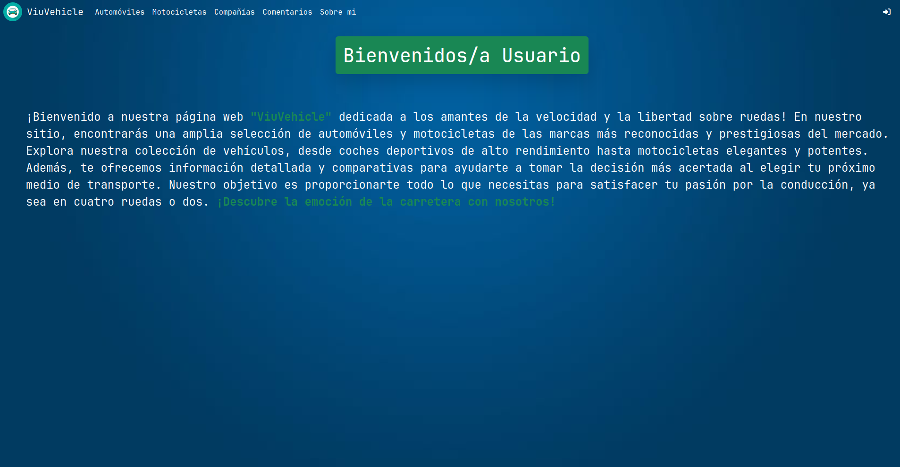

# ViuVehicle - Digitalers Python 🚗 🏎️

Este es un proyecto para poder ver los autos y motos que mas te gustan!!
Ademas, podes dejar tu comentario en la pagina para que pueda seguir mejorando.



## En el proyecto vas a tener las funcionalidades:

- Iniciar Sesion
- Registrarte
- CRUD de los modelos Automovil, Motocicleta, Comentario, Compañía (Solo para usuarios Staff/Admin)
- Eliminar y actualizar comentarios (solamente los que publicaste vos)
- Modificar tu perfil: Nombre, Imagen, Apellido, etc
- Filtrar por nombre los modelos de Automovil, Motocicleta, Comentario y Compañía.

## Usuarios

- Admin
```
santi
123456
```
- "Comun"
```
lucas
123
```
## Pasos a seguir

- Crea una carpeta con el nombre que tu quieras y parate sobre ella 

- Crea un venv e inicialo
```
python -m venv venv
venv\Scripts\activate
```

- Descarga las modulos necesarios
```
pip install Django==4.2.5
python -m pip install Pillow
```

- Clona el repositorio en la carpeta creada inicialmente y parate sobre la carpeta que clonaste
```
git clone https://github.com/Santiago-Aquino/Aquino-Santiago-Digitalers
```

- Correr el proyecto con el siguiente comando
```
python manage.py runserver
```

## Informacion Modelos

|Modelos       | Campos                                                  |
| :------------ | :----------------------------------------------------------- |
| Car         | name, born, description, maximum_speed, image, company                                               |
| Motorcycle     |name, born, description, maximum_speed, image, company  |
| Company      |name, born                       |
| Comment | text, user                                          |
| User | agregue al modelo default de django el campo "image"                                          |


## Herramientas
|Tecnologia       | información                                                  |
| :------------ | :----------------------------------------------------------- |
|![SQLite][sqlite]   | Base de datos                                               |
| ![Stack Overflow][stack overflow]    |Foro para buscar información  |
| ![Bootstrap][bootstrap]     |para las templates (se uso cards,navbars,forms,etc)                       |
| ![Django][django] | Framework de Python                                          |
| ![Python][python] | Lenguaje utilizado                                          |

[sqlite]: https://img.shields.io/badge/sqlite-%2307405e.svg?style=for-the-badge&logo=sqlite&logoColor=white

[stack overflow]: https://img.shields.io/badge/-Stackoverflow-FE7A16?style=for-the-badge&logo=stack-overflow&logoColor=white

[bootstrap]: https://img.shields.io/badge/bootstrap-%238511FA.svg?style=for-the-badge&logo=bootstrap&logoColor=white

[django]: https://img.shields.io/badge/django-%23092E20.svg?style=for-the-badge&logo=django&logoColor=white

[python]: https://img.shields.io/badge/python-3670A0?style=for-the-badge&logo=python&logoColor=ffdd54


## Video y Tests
- link del video: https://www.youtube.com/watch?v=5IwBupPSRDE&t
- Link tests: https://docs.google.com/spreadsheets/d/1AIi4XQmXi9gdH1nVEppdlBEuR129N_9blrzuMzrMVxo/edit?usp=sharing
## Autor

- [@Santiago-Aquino](https://github.com/Santiago-Aquino)

